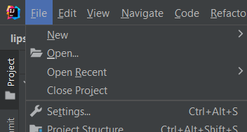
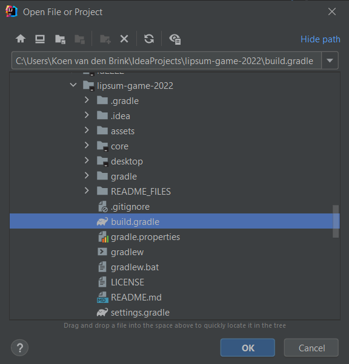

# Lipsum gamejam.Game 2022
Made for the Inter-Actief gamejam.Game Jam (June 2022).

---

## Theme
The theme for the gamejam.Game Jam is:\
**_"Everything has a cost - Break the system"_**.

## Installation
Clone the repository, either via the IntelliJ `Get from VCS` option, or just command-line git. 

Open IntelliJ, navigate to `File > Open`.

Navigate to the place where you cloned the repository, and open the `build.gradle` file.

IntelliJ is based, so it will do everything for you after this.
